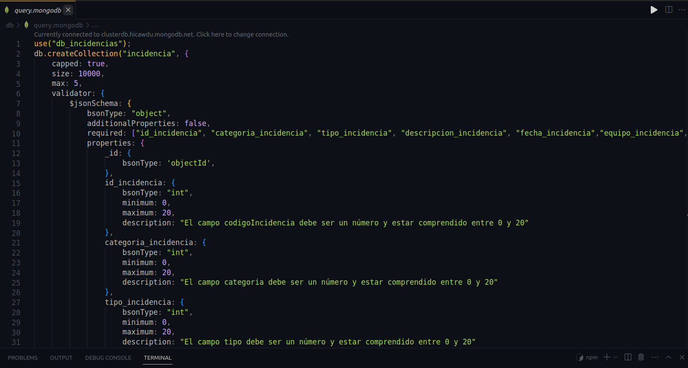
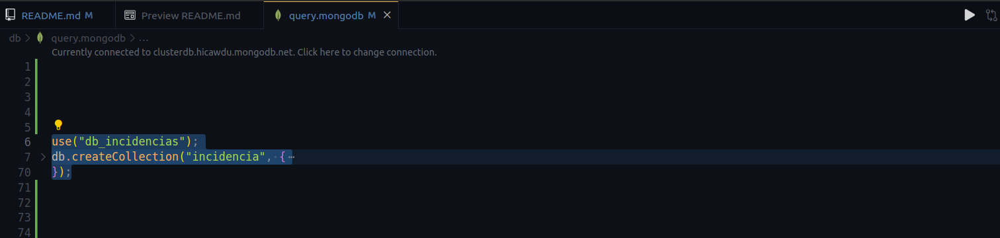
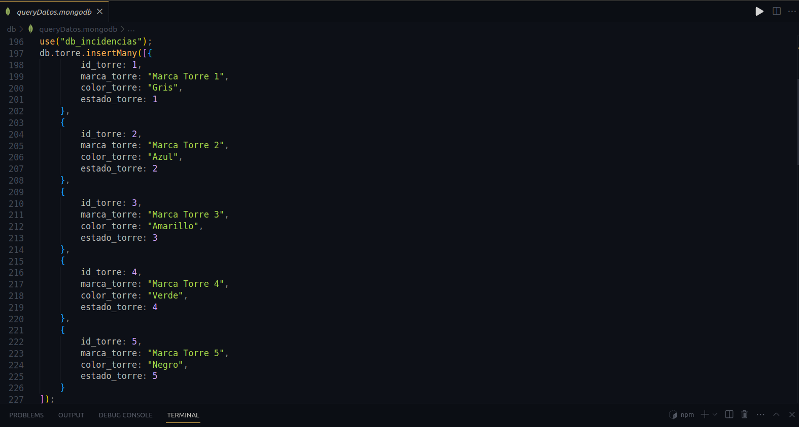
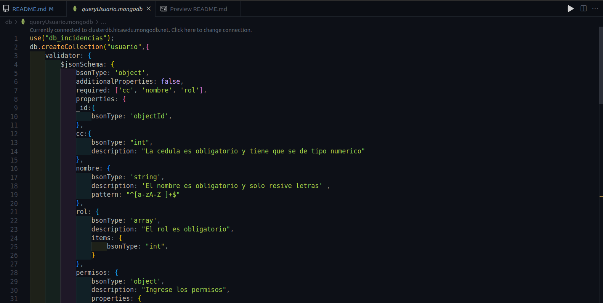
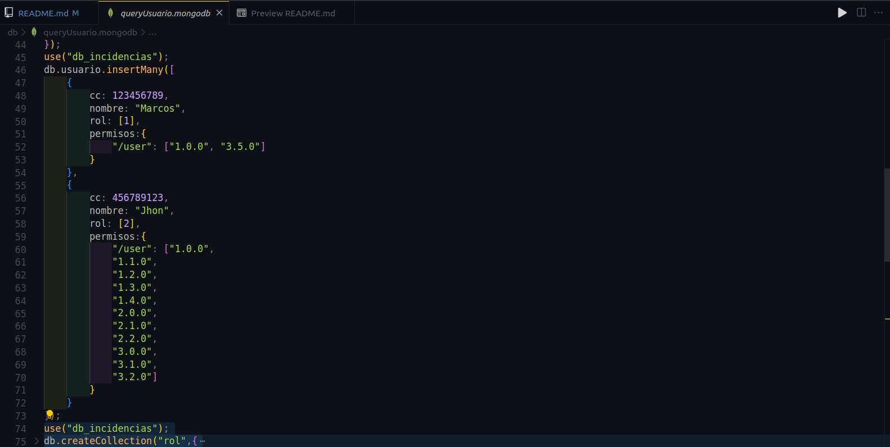
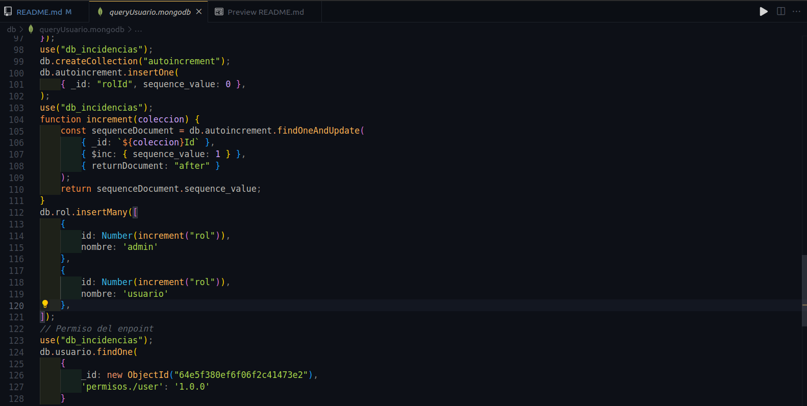

# FActuracion MongoDB

El cliente requiere un sistema de gestión que permita gestionar las ventas y compras, interactuar con proveedores, empleados y pacientes,  generar informes de ventas y caducidad de medicamentos. Es esencial que este software pase por un proceso de análisis de requerimientos, diseño, implementación, pruebas, y eventual retiro, garantizando en todo momento la adaptabilidad, confiabilidad y eficiencia para las operaciones diarias de la farmacia.

## # Consultas

1. Obtener todos los medicamentos con menos de 50 unidades en stock

2. Listar los proveedores con su información de contacto en medicamentos

3. Medicamentos comprados al 'Proveedor A'

4. Obtener recetas médicas emitidas después del 1 de enero de 2023

5. . Total de ventas del medicamento 'Paracetamol'

6. Medicamentos que caducan antes del 1 de enero de 2024

7. Total de medicamentos vendidos por cada proveedor

8. Cantidad total de dinero recaudado por las ventas de medicamentos

9. Recetas prescritas por el Dr. Martínez

10. Medicamentos que no han sido vendidos

11. Obtener el medicamento más caro

12. Número de medicamentos por proveedor

13. Pacientes que han comprado Paracetamol

14. Proveedores que no han vendido medicamentos en el último año

15. Obtener el total de medicamentos vendidos en marzo de 2023

16. Obtener el medicamento menos vendido en 2023

17. Ganancia total por proveedor en 2023 (asumiendo un campo precioCompra en Compras)

18. Promedio de medicamentos comprados por venta

19. Medicamentos que tienen menos de 50 unidades en stock

20. Cantidad de ventas realizadas por cada empleado en 2023

21. Obtener todos los medicamentos que expiren en 2024

22. Empleados que hayan hecho más de 5 ventas en total

23. Medicamentos que no han sido vendidos nunca

24. Paciente que ha gastado más dinero en 2023

25. Empleados que no han realizado ninguna venta en 2023

26. Proveedor que ha suministrado más medicamentos en 2023

27. Pacientes que compraron el medicamento "Paracetamol" en 2023

28. Total de medicamentos vendidos por mes en 2023

29. Empleados con menos de 5 ventas en 2023

30. Número total de proveedores que suministraron medicamentos en 2023

31. Proveedores de los medicamentos con menos de 50 unidades en stock

32. Pacientes que no han comprado ningún medicamento en 2023

33. Medicamentos que han sido vendidos cada mes del año 2023

34. Empleado que ha vendido la mayor cantidad de medicamentos distintos en 2023

35. Total gastado por cada paciente en 2023

36. Medicamentos que no han sido vendidos en 2023

37. Proveedores que han suministrado al menos 5 medicamentos diferentes en 2023

38. Total de medicamentos vendidos en el primer trimestre de 2023

39. Empleados que no realizaron ventas en abril de 2023

40. Medicamentos con un precio mayor a 50 y un stock menor a 100

# DATABASE A USAR

Este es el esquema de la base de datos en <span style="color:orange;">MySQL</span> y lo vamos a transalada a <span style="color:green;">MongoDB</span><br><br> 
<br><br>


# DEPENDENCIAS IMPLEMENTADAS

```JSON
        "class-transformer": "0.5.1",
        "class-validator": "0.14.0",
        "cookie-parser": "1.4.6",
        "dotenv": "16.3.1",
        "express": "4.18.2",
        "express-query-boolean": "2.0.0",
        "express-rate-limit": "6.8.1",
        "express-routes-versioning": "^1.0.1",
        "express-session": "1.17.3",
        "express-validator": "7.0.1",
        "jose": "4.14.4",
        "mongodb": "5.7.0",
        "nodemon": "3.0.1",
        "passport": "0.6.0",
        "passport-http-bearer": "1.0.1"
```
<br><br>

# IMPLEMENTACION PROYECTO

### CLONACION DEL REPOSITORIO

Clonamos el repositorio con visual estudio code y lo guardamos en una carpeta de nuestra elección

```
https://github.com/JoseCabrejoVillarCampus/plantillafiltro
```
<br><br>

### INSTALACION DE DEPENDENCIAS

Para Usar las Dependencias que estan en el package.json :
```
npm install
```
<br><br>

# CONFIGURACION DEL .env

Dentro de la Ruta que creamos para alojar el proyecto buscamos  el  archivo llamado ".env.example" y lo cambiamos por ".env"
En el archivo .env, configurar las siguientes variables de conexión a la base de datos:
```
MY_SERVER={"hostname":"","port":""}
ATLAS_USER=""
ATLAS_PASSWORD=""
ATLAS_DB=""
JWT_PRIVATE_KEY=""
```
En el campo de MY_SERVER ingrese un hostname y un puerto a su elección(preferiblemente mayor al 5000). Recuerde que por defecto el local host requiere que el hostname es 127.0.0.1. pero puede ser,
ATLAS_USER es el usuario de la base de datos registrado en Atlas y ATLAS_PASSWORD es la contraseña que le asignamos, ATLAS_DB es el nombre de la base de datos y el JWT_PRIVATE_KEY es la palabra secreta que usaremos para generar los tokens de JWT

Hemos Creado un Usuario con acceso a la db de Moongo npara el testeo:

```
MY_SERVER={"hostname":"","port":""}
ATLAS_USER="miguel"
ATLAS_PASSWORD="miguel"
ATLAS_DB="db_incidencias"
JWT_PRIVATE_KEY=""
```

<br><br>

# INICIAR nodemon

```
npm run dev
```
<br><br>

# INSTALACION BASE DE DATOS

Teniendo una cuenta en MongoDB Atlas, ya registrado indicado en la documentacion
https://github.com/JoseCabrejoVillarCampus/mongoDocumentacion

Nos dirigimos la carpeta [db](db), en el archivo  [query.mongodb](db/query.mongodb)
aca observaremos que para crear las coleciones, hemos realizado esquemas para la verificacion de tipo y patrones de datos

<br><br>

Procedemos a ejecutarlo uno por uno, en este caso hemos puesto la creacion de la colecion y la insercion de datos para cada una seguidamente, vasta con seleccionar la coleccion y dar en el boton "RUN" alojado en la esquina derecha superior

<br><br>

Diseño para la insercion de varios Datos para la tabla correspondiente alojasod en [db](db), en el archivo [queryDatos.mongodb](db/queryDatos.mongodb), la ejecutamos de forma igual a la creacion de la coleccion

<br><br>

# INSTALACION COLECCIONES USUARIO Y LOGIN

Ahora nos dirigimos dentro de la misma carpeta [db](db), esta vez en el archivo  [queryUsuario.mongodb](db/queryUsuario.mongodb), en este archivo vamos a crear las colecciones <span style="color:green;">usuario</span> , <span style="color:green;">login</span> , <span style="color:green;">rol</span>,para la validacion por token del portador segun la strategia [http-passport-bearer](https://www.passportjs.org/packages/passport-http-bearer/), en nuestro proyecto [passPortHelper](helpers/passPortHelper.js), ademas de otras peueñas cosas, que simplemente ahi que ejecutar con el boton RUN

## Creación de las Colecciones

<br><br>

## Defininendo los Perimsos por Usuario

<br><br>

## Creacion del Autoincremental

Esta nos permite dar un id autoincremental a cada rol agregado

<br><br>

